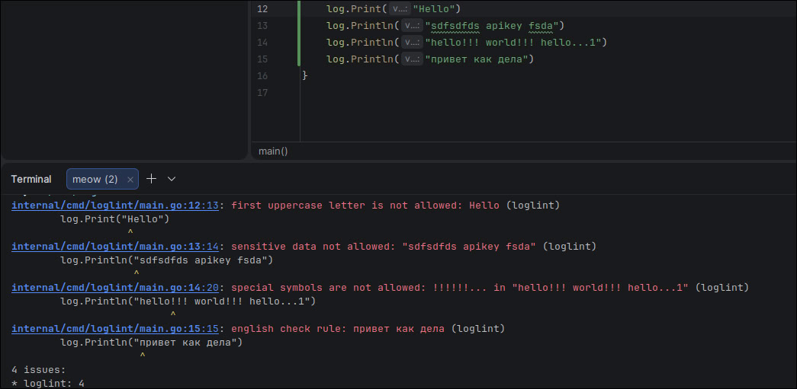
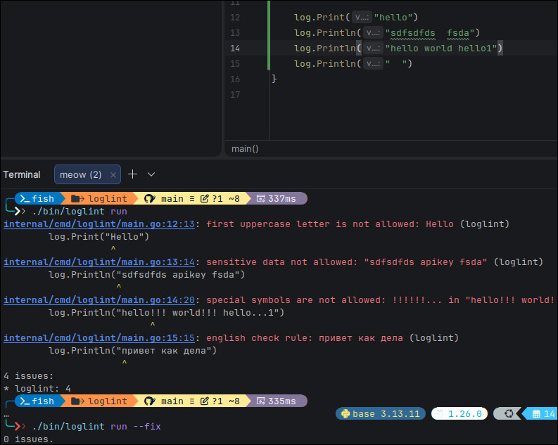
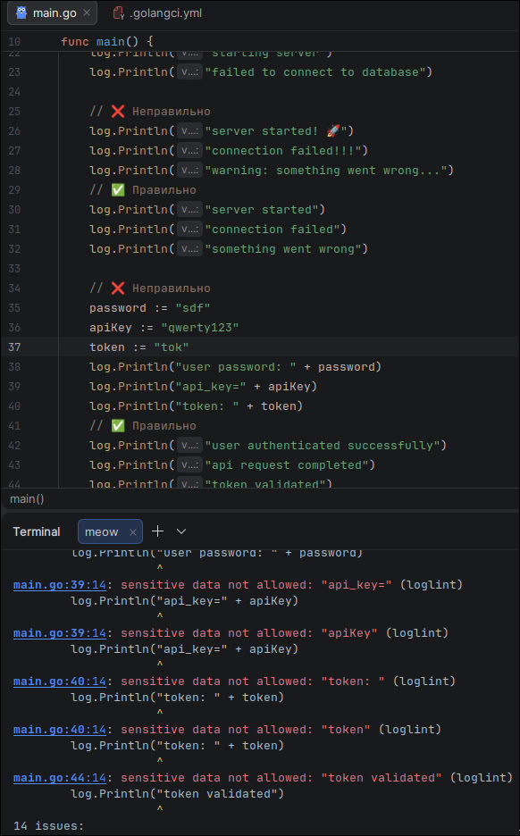
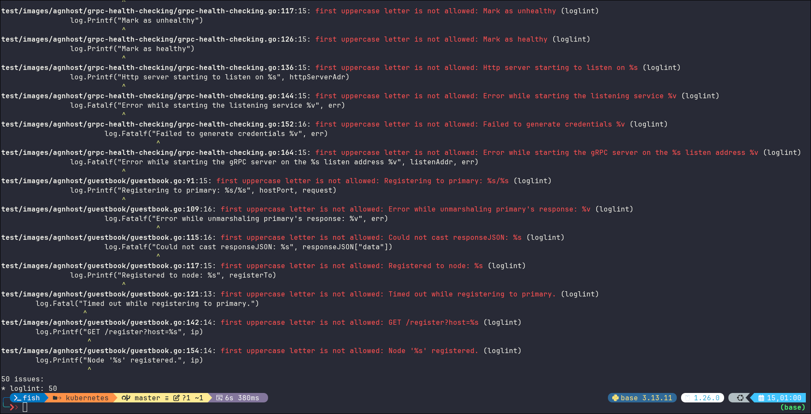

# loglint
This is a linter plugin that checks code style in log-messages

Plugin was build as module plugin for `golangci-lint`
- https://golangci-lint.run/docs/plugins/module-plugins/
______
# Bonus Tasks:
1. Configuration: Rules configuration in `.golangci.yml` \
```bash
settings:
  rules:
    - englishcheck
    - specialsymbols
    - lowercase
    - keywords
```
You can disable or enable some rules by editing `.golangci.yml` \
2. Auto fixing: `SuggestedFixes` for automatic error fixing: use `path-to-loglint-project.../bin/loglint run --fix`
3. Custom patterns: Added configuration field to \
```bash
settings:
    keywords:
    - "ASD"
    - "onemorekeyword"
```
You add keywords with sensitive data by editing `.golangci.yml`

4. CI/CD: Look at the `.github/` directory

# Building
## Versions:
- go: `go1.26.0`
- golangci-lint `2.9.0 built with go1.26.0`
```bash
git clone https://github.com/leoscrowi/loglint.git
cd loglint
golangci-lint custom -v
```

# Running in other project
1) You need to build loglint, look at [this](#building)
2) At first you need to be at your project directory that you want to lint
2) Create `.golangci.yml`
```bash
touch .golangci.yml
```
4) Fill the config file, you can use this:
```bash
version: "2"

linters:
  default: none
  enable:
    - loglint

  settings:
    custom:
      loglint:
        type: module
        description: linter for reporting log messages
        original-url: github.com/leoscrowi/loglint
        settings:
          rules:
            - englishcheck
            - specialsymbols
            - lowercase
            - keywords
          keywords:
            - "ASD"
            - "onemorekeyword"

issues:
  max-same-issues: 0
  uniq-by-line: false
```

5) Run the `path-to-loglint-project.../bin/loglint run -v ./...`

# [Examples](docs)

___

___

___

# Functions that are checked by the linter
## Packages:
- log
- log/slog
- go.uber.org/zap

### Package `log`:
```go
type Logger
func (l *Logger) Fatal(v ...any)
func (l *Logger) Fatalf(format string, v ...any)
func (l *Logger) Fatalln(v ...any)
func (l *Logger) Panic(v ...any)
func (l *Logger) Panicf(format string, v ...any)
func (l *Logger) Panicln(v ...any)
func (l *Logger) Print(v ...any)
func (l *Logger) Printf(format string, v ...any)
func (l *Logger) Println(v ...any)
___________________________________________________
func Fatal(v ...any)
func Fatalf(format string, v ...any)
func Fatalln(v ...any)
func Flags() int
func Panic(v ...any)
func Panicf(format string, v ...any)
func Panicln(v ...any)
func Print(v ...any)
func Printf(format string, v ...any)
func Println(v ...any)
```

### Package `log/slog`
```go
type Logger
func (l *Logger) Debug(msg string, args ...any)
func (l *Logger) DebugContext(ctx context.Context, msg string, args ...any)
func (l *Logger) Error(msg string, args ...any)
func (l *Logger) ErrorContext(ctx context.Context, msg string, args ...any)
func (l *Logger) Info(msg string, args ...any)
func (l *Logger) InfoContext(ctx context.Context, msg string, args ...any)
func (l *Logger) Log(ctx context.Context, level Level, msg string, args ...any)
func (l *Logger) LogAttrs(ctx context.Context, level Level, msg string, attrs ...Attr)
func (l *Logger) Warn(msg string, args ...any)
func (l *Logger) WarnContext(ctx context.Context, msg string, args ...any)
________________________________________________________________________________________
func Debug(msg string, args ...any)
func DebugContext(ctx context.Context, msg string, args ...any)
func Error(msg string, args ...any)
func ErrorContext(ctx context.Context, msg string, args ...any)
func Info(msg string, args ...any)
func InfoContext(ctx context.Context, msg string, args ...any)
func Log(ctx context.Context, level Level, msg string, args ...any)
func LogAttrs(ctx context.Context, level Level, msg string, attrs ...Attr)
func Warn(msg string, args ...any)
func WarnContext(ctx context.Context, msg string, args ...any)
```

### Package `go.uber.org/zap`
```go
type Logger
func (log *Logger) DPanic(msg string, fields ...Field)
func (log *Logger) Debug(msg string, fields ...Field)
func (log *Logger) Error(msg string, fields ...Field)
func (log *Logger) Fatal(msg string, fields ...Field)
func (log *Logger) Info(msg string, fields ...Field)
func (log *Logger) Log(lvl zapcore.Level, msg string, fields ...Field)
func (log *Logger) Panic(msg string, fields ...Field)
func (log *Logger) Warn(msg string, fields ...Field)
___________________________________________________________________________________________
type SugaredLogger
func (s *SugaredLogger) DPanic(args ...interface{})
func (s *SugaredLogger) DPanicf(template string, args ...interface{})
func (s *SugaredLogger) DPanicln(args ...interface{})
func (s *SugaredLogger) DPanicw(msg string, keysAndValues ...interface{})
func (s *SugaredLogger) Debug(args ...interface{})
func (s *SugaredLogger) Debugf(template string, args ...interface{})
func (s *SugaredLogger) Debugln(args ...interface{})
func (s *SugaredLogger) Debugw(msg string, keysAndValues ...interface{})
func (s *SugaredLogger) Error(args ...interface{})
func (s *SugaredLogger) Errorf(template string, args ...interface{})
func (s *SugaredLogger) Errorln(args ...interface{})
func (s *SugaredLogger) Errorw(msg string, keysAndValues ...interface{})
func (s *SugaredLogger) Fatal(args ...interface{})
func (s *SugaredLogger) Fatalf(template string, args ...interface{})
func (s *SugaredLogger) Fatalln(args ...interface{})
func (s *SugaredLogger) Fatalw(msg string, keysAndValues ...interface{})
func (s *SugaredLogger) Info(args ...interface{})
func (s *SugaredLogger) Infof(template string, args ...interface{})
func (s *SugaredLogger) Infoln(args ...interface{})
func (s *SugaredLogger) Infow(msg string, keysAndValues ...interface{})
func (s *SugaredLogger) Log(lvl zapcore.Level, args ...interface{})
func (s *SugaredLogger) Logf(lvl zapcore.Level, template string, args ...interface{})
func (s *SugaredLogger) Logln(lvl zapcore.Level, args ...interface{})
func (s *SugaredLogger) Logw(lvl zapcore.Level, msg string, keysAndValues ...interface{})
func (s *SugaredLogger) Panic(args ...interface{})
func (s *SugaredLogger) Panicf(template string, args ...interface{})
func (s *SugaredLogger) Panicln(args ...interface{})
func (s *SugaredLogger) Panicw(msg string, keysAndValues ...interface{})
func (s *SugaredLogger) Warn(args ...interface{})
func (s *SugaredLogger) Warnf(template string, args ...interface{})
func (s *SugaredLogger) Warnln(args ...interface{})
func (s *SugaredLogger) Warnw(msg string, keysAndValues ...interface{})
```
